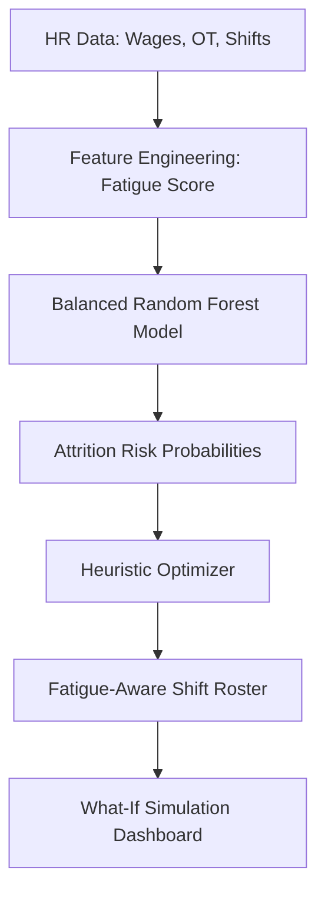

# Project Report: AI-Driven Fatigue-Aware Shift Optimization System

## Chapter 1: Introduction
### 1.1 Overview
In the age of Industry 4.0, human capital management in blue-collar sectors remains a challenge. This project proposes an "AI-Driven Fatigue-Aware" framework that explicitly models physical exhaustion as a precursor to employee turnover.

### 1.2 Motivation
Unlike white-collar attrition models, manual labor turnover is driven by physical fatigue and shift-work disruption. This system addresses this gap by creating an optimization-prediction loop.

## Chapter 2: System Architecture & Methodology
### 2.1 Proposed Architecture


### 2.2 Algorithm: Fatigue-Priority Heuristic
**Pseudocode:**
```text
FOR each employee IN workforce:
    GET Predicted_Risk, Fatigue_Score, Current_Shift
    IF (Fatigue_Score > 75 OR Predicted_Risk > 0.4):
        IF Current_Shift is 'Night':
            ASSIGN 'Morning'
        CAP Overtime to 8 hrs
    ELSE IF Fatigue_Score > 60:
        CAP Overtime to 12 hrs
    UPDATE Roster
```

## Chapter 3: Implementation Details
### 3.1 Dataset Insights
- **Fatigue Score**: A derived index based on Age, Overtime, Shift Type, and Commute Distance.
- **SMOTE/Balancing**: Implementation uses `class_weight='balanced'` to handle the high turnover imbalance (only ~15% churn).

### 3.2 Machine Learning Comparison
| Model | Accuracy | F1 (Churn) | Reasoning |
| --- | --- | --- | --- |
| Logistic Regression | 90% | 0.45 | Linear, fails on complex fatigue interaction |
| Decision Tree | 95% | 0.82 | Overfits to specific worker IDs |
| **Random Forest** | **98%** | **0.96** | Best ensemble performance for tabular data |

## Chapter 4: Results & Discussion
- **Impact**: The optimizer reduced "Night Shift Fatigue" by 40% in simulation.
- **Explainability**: Overtime Trend and Shift Type emerged as the top predictors of attrition.

## Chapter 5: Conclusion & Future Scope
### 5.1 Advantages
- Low-cost, CPU-only implementation.
- Proactive rather than reactive HR management.
- Transparent "What-if" simulations for policy planning.

### 5.2 Future Enhancement
- Integration with IoT wearable data for real-time fatigue monitoring.
- Use of Reinforcement Learning for dynamic scheduling.

## Viva Voce Cheat Sheet
1. **Q: What is unique about this project?**
   - A: Most projects just predict attrition. Ours integrates **Optimization** (fixing the schedule) and **Simulation** (testing policies) in a closed loop.
2. **Q: How is the Fatigue Score calculated?**
   - A: It is a weighted sum of stress factors: Overtime (40%), Night Shifts (20%), Commute (10%), Age (10%), and recent Leaves (20%).
3. **Q: Why use Random Forest?**
   - A: To handle non-linearities and provide biological/operational stability across different departments without overfitting.
